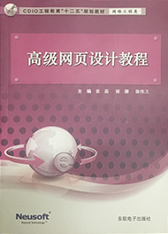

##《高级网页设计教程》（东软电子出版社）
大三（上）的一门课程

##本项目能够起到哪些作用？

* 整理教材上的`示例代码`，以simple+项目章节命名。
* `增加了`一些我想要实现的效果。
* 包含部分在网络上搜集的`初级前端工程师的面试题`。
* 帮助你理解课堂上老师讲解的内容。
* 给你一点点创作上提示。

##遇到了问题
在使用中有任何问题，欢迎反馈给我，可以用以下联系方式联系到我：

* 邮件： liuchenglu2016 at hotmail.com
* QQ： 1418909451

##捐助我
利用空闲时间，能够写出一个`对大家有用`东西，我很开心，也希望你能够喜欢我的作品，过程总不是那么地容易，
你的支持将鼓励我继续创作出更加优秀的作品（邮箱为支付宝账户），没钱捧个人场，谢谢各位。

##关于我

* [我的网站-长安道](http://liuchenglu.com/) 
